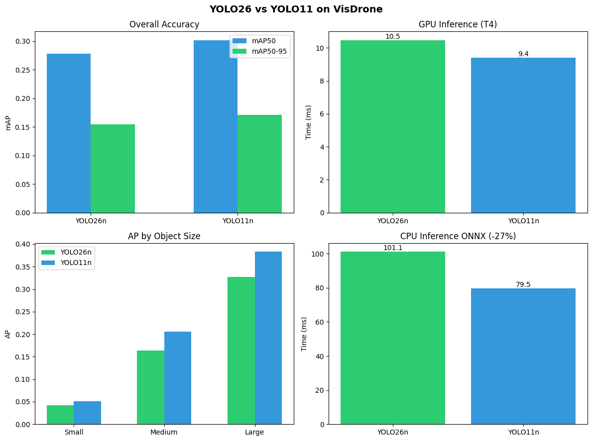

# YOLO26 vs YOLO11 Benchmark on VisDrone

[](https://www.kaggle.com/code/muraraimbekov/yolo26-vs-yolo11-visdrone-benchmark)
[](https://opensource.org/licenses/Apache-2.0)

Independent benchmark comparing YOLO26 and YOLO11 on drone imagery with small objects.

## Motivation

Ultralytics claims YOLO26 delivers:
- **43% faster CPU inference** compared to YOLO11
- **Better small object detection** via ProgLoss and STAL
- **Smaller model size** due to DFL removal

These benchmarks are typically run on COCO. This project tests whether these improvements transfer to VisDrone - a challenging aerial dataset where ~60-80% of objects are smaller than 32x32 pixels.

## Results



### Accuracy

| Model | mAP50 | mAP50-95 | AP_small | AP_medium | AP_large |
|-------|-------|----------|----------|-----------|----------|
| YOLO26n | 0.278 | 0.155 | 0.042 | 0.164 | 0.327 |
| YOLO11n | 0.302 | 0.171 | 0.051 | 0.205 | 0.383 |

### Speed

| Model | GPU (T4) | CPU (ONNX) |
|-------|----------|------------|
| YOLO26n | 10.47 ms | 101.14 ms |
| YOLO11n | 9.41 ms | 79.53 ms |

### Model Size

| Model | Parameters | ONNX Size |
|-------|------------|-----------|
| YOLO26n | 2.51M | 9.8 MB |
| YOLO11n | 2.59M | 10.6 MB |

## Claim Verification

| Claim | Expected | Actual | Verified |
|-------|----------|--------|----------|
| 43% faster CPU | YOLO26 faster | YOLO26 27% slower | No |
| Better small objects | YOLO26 higher AP_small | YOLO11 19% higher | No |
| Smaller model | YOLO26 smaller | 3% smaller | Yes |

## Why Claims Don't Transfer

YOLO improvements are optimized for COCO dataset characteristics. VisDrone presents different challenges:

- **Object size distribution**: VisDrone has 60-80% small objects vs ~40% in COCO
- **Aerial perspective**: Top-down view vs ground-level in COCO
- **Dense scenes**: More objects per image with frequent occlusions

Research shows newer YOLO versions don't always outperform older ones on specialized domains. Standard architectures may need domain-specific adaptations for aerial imagery.

## Methodology

- **Dataset**: VisDrone2019-DET (6,471 train / 548 val images)
- **Hardware**: Kaggle T4 GPU (16GB)
- **Training**: 50 epochs, batch=16, imgsz=640
- **CPU Benchmark**: ONNX Runtime on Intel Xeon @ 2.00GHz
- **Evaluation**: pycocotools with AP by object size

## Reproduce

[](https://www.kaggle.com/code/muraraimbekov/yolo26-vs-yolo11-visdrone-benchmark)

Or locally:

```bash
pip install ultralytics pycocotools onnxruntime

yolo detect train model=yolo26n.pt data=VisDrone.yaml epochs=50 imgsz=640 batch=16
yolo detect train model=yolo11n.pt data=VisDrone.yaml epochs=50 imgsz=640 batch=16
```

## References

- [YOLO26 Documentation](https://docs.ultralytics.com/models/yolo26/)
- [VisDrone Dataset](https://docs.ultralytics.com/datasets/detect/visdrone/)
- [VisDrone Challenge](http://aiskyeye.com/)

## License

Apache License 2.0

## Author

Murat Raimbekov — [@raimbekovm](https://github.com/raimbekovm)
